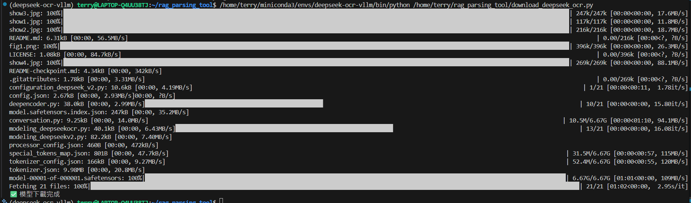
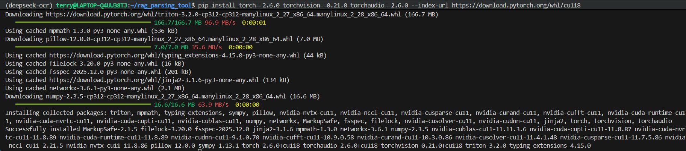
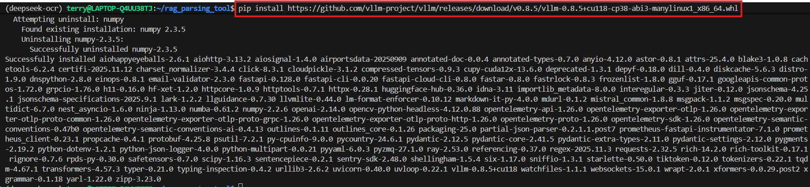
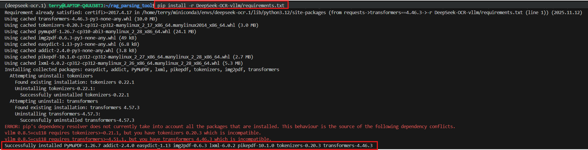
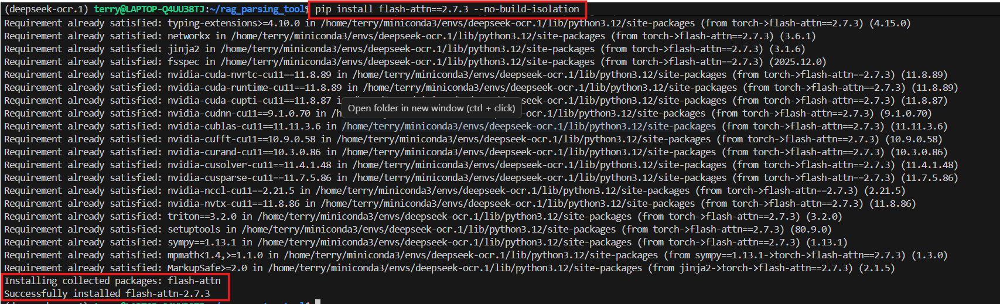
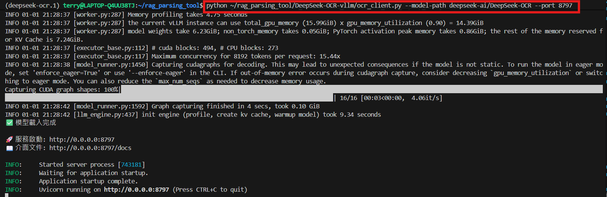
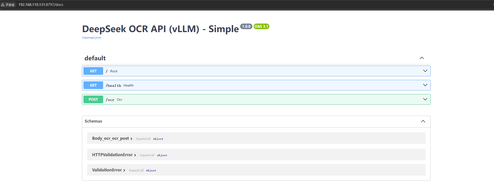
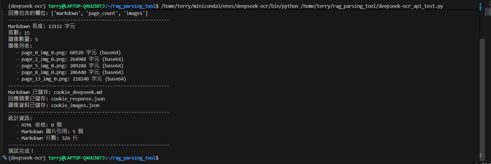

# DeepSeek-OCR 安裝說明文件

## 安裝步驟

### 1. 建立 Python 虛擬環境

&emsp;&emsp;首先，我们需要创建一个独立的 Python 虚拟环境。虚拟环境可以隔离项目依赖，避免与系统其他 Python 项目产生冲突。执行如下命令

```bash
    conda create -n deepseek-ocr python=3.12.9 -y
```

&emsp;&emsp;接下来啟動虚拟环境：

```bash
    conda activate deepseek-ocr
```

### 2. 下載模型

先安裝 huggingface\_hub 套件

```bash
    pip install huggingface_hub
```

然後執行 download 指令下載模型：

```bash
    python download_deepseek_ocr.py
```

<div align=center></div>

### 3. 安裝相關套件

首先，安裝 toch 相關套件：

```bash
pip install torch==2.6.0 torchvision==0.21.0 torchaudio==2.6.0 --index-url https://download.pytorch.org/whl/cu118
```

<div align=center></div>

下載 vllm-0.8.5 [whl](https://github.com/vllm-project/vllm/releases/tag/v0.8.5)

```bash
    pip install https://github.com/vllm-project/vllm/releases/download/v0.8.5/vllm-0.8.5+cu118-cp38-abi3-manylinux1_x86_64.whl
```

<div align=center></div>

安裝 `requirements.txt` 內的相依套件：

```bash
    pip install -r DeepSeek-OCR-vllm/requirements.txt
```

<div align=center></div>

最後，安裝 flash-attention：

```bash
pip install flash-attn==2.7.3 --no-build-isolation
```

<div align=center></div>

&emsp;&emsp;安装结束后，使用我们给大家提供的 `ocr_client.py` 文件，启动 `DeepSeek OCR API 接口` 服务。

```bash
    python ~/rag_parsing_tool/DeepSeek-OCR-vllm/ocr_client.py --model-path deepseek-ai/DeepSeek-OCR --port 8797
```

&emsp;&emsp;启动成功后，会显示如下：

<div align=center></div>

啟動成功後，可以用瀏覽器打開 http://127.0.0.1:8797/docs 來看 API 文件，像下面這樣：

<div align=center></div>

## 🧪 連接測試

執行 `deepseek_ocr_api_test.py` 腳本，測試 `DeepSeek-OCR` API 服務是否能正常連接：
```bash
    python ./api_test/deepseek_ocr_api_test.py
```

<div align=center></div>
