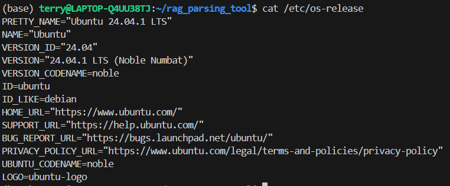
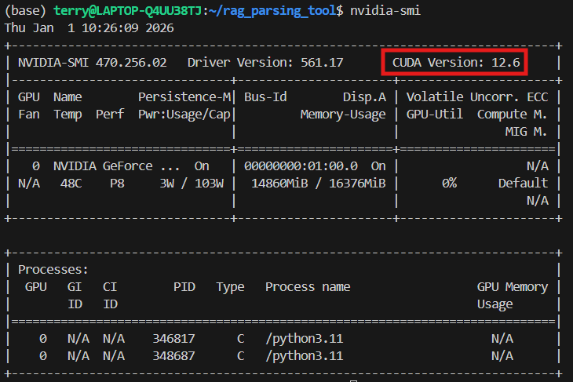
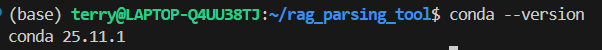
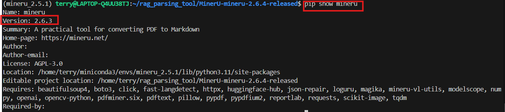
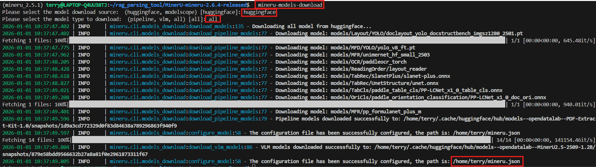
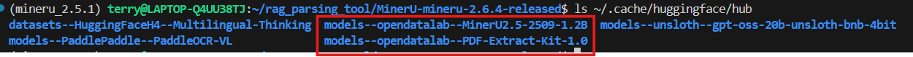
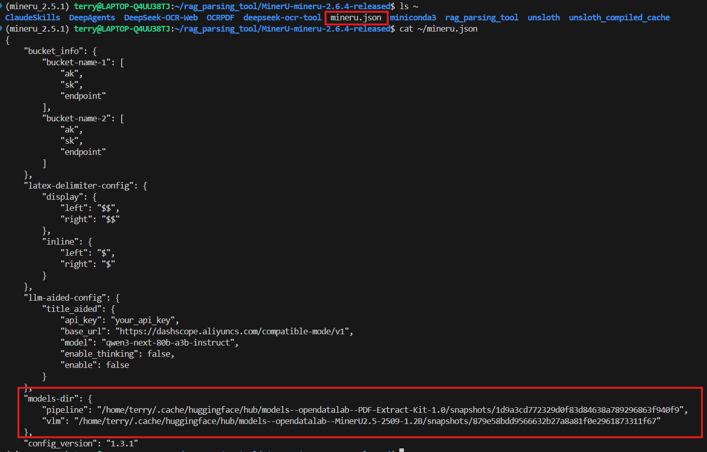
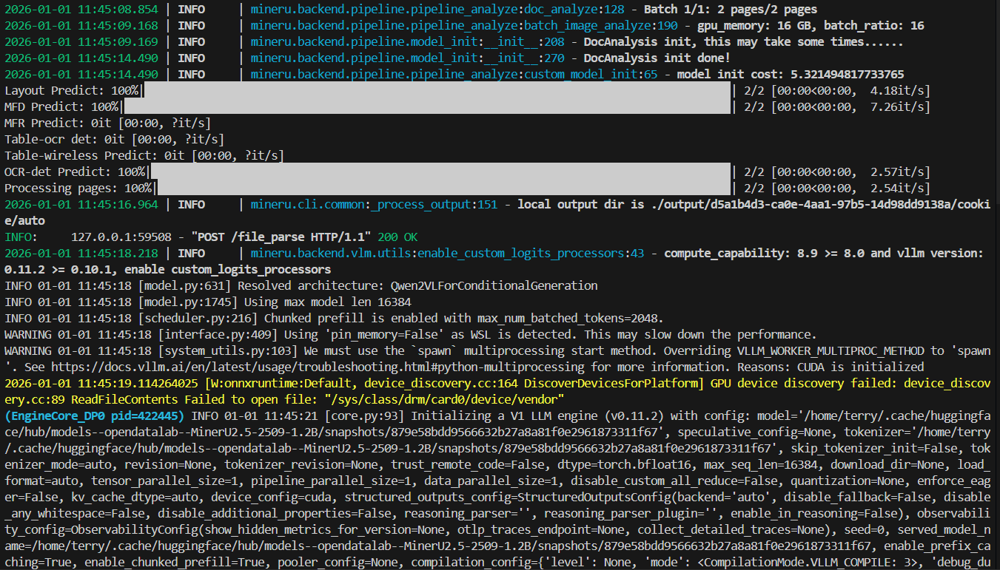

# MinerU 安裝說明文件

&emsp;&emsp;`MinerU` 的新版本不再嚴格限制`python 3.10`版本，但建議大家使用`python 3.11`或者`python 3.12`，`python 3.13`可能存在相容性問題。

- **步驟 1. 確認系統版本**

&emsp;&emsp;我們使用的是`Ubuntu 24.04` 系統，可以透過`cat /etc/os-release` 指令查看系統版本，如下圖所示：

<div align="center">    
    
</div>


- **步驟 2. 確認`CUDA` 版本**

&emsp;&emsp;在`Linux` 系統下，可以透過`nvidia-smi` 指令查看`CUDA` 版本，這裡的伺服器配置是單卡的`RTX 4090` 顯示卡，如下圖所示：

<div align="center">
    
</div>

&emsp;&emsp;`CUDA Version` 顯示的版本號必須 `>= 12.1`，若顯示的版本號小於`12.1`，需要自行升級`CUDA` 版本。

- **步驟 3. 確認 `Conda` 版本**

&emsp;&emsp;我們使用的是`Anaconda` 安裝的`Conda` 環境，可以透過`conda --version` 指令查看`Conda` 版本，如下圖所示：

<div align="center">
    
</div>

&emsp;&emsp;如果出現`Conda not found` 等錯誤，需先安裝`Conda` 環境，再執行接下來的步驟。

- **步驟 4. 使用`Conda` 建立`Python 3.11` 版本的虛擬環境**

&emsp;&emsp;執行以下指令建立一個全新的虛擬環境

```bash 
    conda create --name mineru_2.5 python==3.11 -y
```

- **步驟 5. 啟用虛擬環境**

&emsp;&emsp;建立完虛擬環境後，使用`Conda` 啟用虛擬環境，透過`conda activate mineru_2.5` 指令啟用，如下圖所示：

- **步驟 6. 下載 MinerU 原始碼檔案，並解壓縮**
```bash
wget https://github.com/opendatalab/MinerU/archive/refs/tags/mineru-2.6.4-released.tar.gz

tar -xzvf mineru-2.6.4-released.tar.gz
```
<div align="center">
    
</div>

<div align="center">
    
</div>

- **步驟 7. 安裝`MinerU` 專案相依套件**

&emsp;&emsp;使用`Conda` 安裝`MinerU` 專案相依套件，需要透過以下指令在新建的`mineru` 虛擬環境中安裝執行`MinerU` 專案程式的所有相依套件，指令如下：

```bash
    pip install -e .[all]
```

<div align="center">
    
</div>

&emsp;&emsp;透過`pip show mineru` 指令查看`MinerU` 專案的版本：

<div align="center">
    
</div>

&emsp;&emsp;至此，基礎的`MinerU` 專案相依套件就安裝完成了，接下來我們需要下載`MinerU` 專案中用到的模型檔案，並進行專案設定。

- **步驟 8. 下載`MinerU` 專案中用到的模型檔案**

&emsp;&emsp;新版本的`MinerU` 專案提供了一鍵下載所有模型檔案的腳本，我們只需要執行以下指令即可：

```bash
    mineru-models-download
```
&emsp;&emsp;執行該指令時需根據自身需求靈活選擇要下載到本地的模型。其中`modelscope` 和 `huggingface` 是兩個不同的模型下載來源，我們只需選擇其中一個即可。其次，`pipeline`指的是用於文件解析的一系列模型，而`vlm`指的是用於視覺語言模型的模型，即`MinerU2.0-2505-0.9B` 模型。如果選擇`all`，則會全部下載。


<div align="center">
    
</div>

&emsp;&emsp;等待下載完成後，所有模型檔案的預設儲存路徑為：

```bash
     ~/.cache/huggingface/hub
```

<div align="center">
    
</div>

&emsp;&emsp;並且，也會自動在`~/mineru.json` 檔案中設定用於後續使用的模型路徑。

<div align="center">
    
</div>

&emsp;&emsp;至此，`MinerU` 專案的本地設定就全部完成了，接下來我們可以嘗試執行`MinerU` 專案並進行`PDF` 文件解析測試。

# MinerU 啟動 vLLM API 推理服務

&emsp;&emsp;接下來新開啟一個終端，啟動`mineru-api` 服務：

```bash
    export MINERU_MODEL_SOURCE=local  # 注意：這裡需要將模型來源設定為本地
    mineru-api --port 50000
```
<div align="center">
    
</div>


&emsp;&emsp;啟動後，在`192.168.110.131:50000/docs`中可以看到介面服務：

<div align="center">
    
</div>

# MinerU vLLM API 服務連接測試

執行 `minerU_api_test.py` 腳本，測試`MinerU` vLLM API 服務是否能正常連接：

```bash
    python minerU_api_test.py
```
成功後，會看到如下的結果：
<div align="center">
    
</div>

<div align="center">
    
</div>
