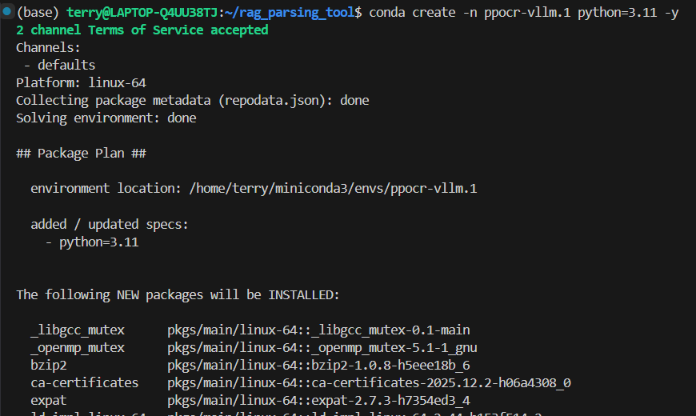
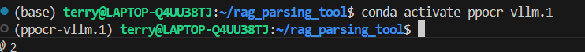
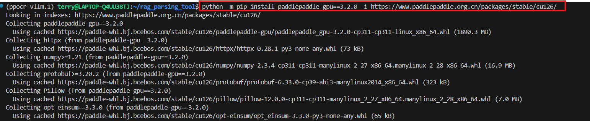
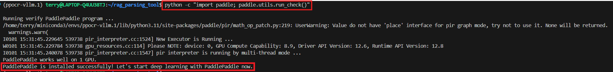
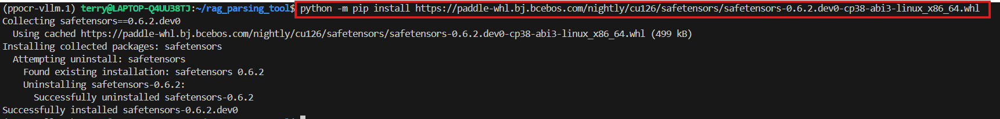
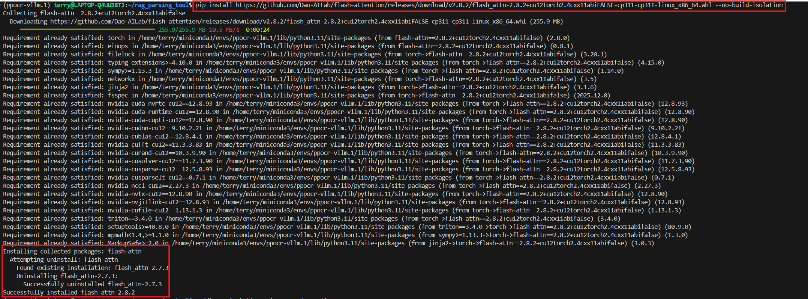
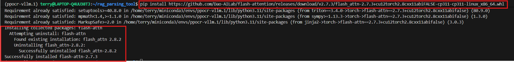
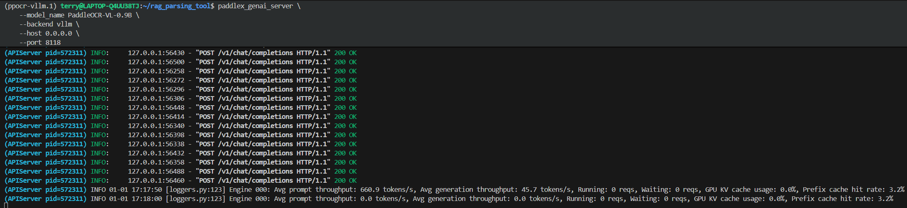
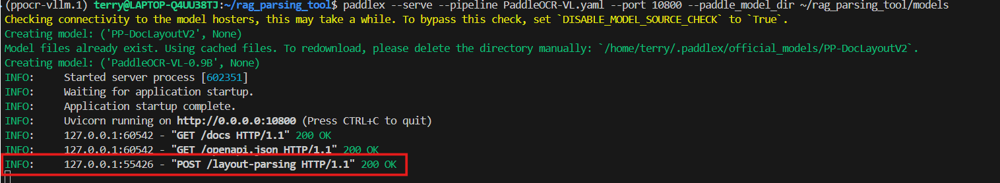

# PaddleOCR 安裝說明文件

這份文件會教你怎麼在自己的系統上安裝跟設定 PaddleOCR，步驟都很詳細。照著下面的指示做，就可以順利安裝跟執行 PaddleOCR。

## 安裝步驟

### 1. 建立 Python 虛擬環境

　　首先，我們要先建立一個獨立的 Python 虛擬環境。虛擬環境可以把專案的相依套件隔開，不會跟系統裡其他 Python 專案打架。請執行下面這行指令：

```bash
    conda 建立 -n ppocr-vllm python=3.11 -y
```

　　說明如下：

- `--name ppocr-vllm`：這是虛擬環境的名字，你可以自己取
- `python==3.11`：指定 Python 版本要用 3.11 (PaddleOCR 推薦用這個版本)

　　執行完會像下面這張圖：

<div align=center></div>

　　接下來要啟動虛擬環境：

```bash
    conda activate ppocr-vllm
```

　　啟動後，你會看到命令列前面多了 `(ppocr-vllm)`，這就代表你已經進到虛擬環境裡了。

<div align=center></div>

### 2. 安裝 PaddleOCR 工具框架

　　要用 PaddleOCR-VL，首先要安裝 PaddleOCR 的工具框架。可以參考官方文件：https://www.paddlepaddle.org.cn/install/quick?docurl=/documentation/docs/zh/develop/install/pip/linux-pip.html

<div align=center></div>

　　這邊我們安裝 PaddlePaddle 3.2.0 版本。請執行下面這行指令：

```bash
    python -m pip install paddlepaddle-gpu==3.2.0 -i https://www.paddlepaddle.org.cn/packages/stable/cu126/
```

　　說明如下：

- `paddlepaddle-gpu==3.2.0`：GPU 版本的 PaddlePaddle 3.2.0
- `-i https://...`：用百度官方鏡像源，下載比較快
- `cu126`：對應 CUDA 12.6 版本

　　安裝過程如下圖：

<div align=center></div>

　　安裝好之後，建議先驗證 PaddlePaddle 有沒有裝好，請執行下面這行指令：

```bash
    python -c "import paddle; paddle.utils.run_check()"
```

<div align=center></div>

　　接下來要注意，PaddleOCR-VL 會用 `safetensors` 格式來存模型權重，要另外安裝指定版本，請執行：

```bash
    python -m pip install https://paddle-whl.bj.bcebos.com/nightly/cu126/safetensors/safetensors-0.6.2.dev0-cp38-abi3-linux_x86_64.whl
```

　　這是目前 PaddleOCR-VL 相容的 safetensors 版本，安裝很快。

<div align=center></div>

### 3. 下載 PaddleOCR-VL 模型

　　PaddleOCR-VL 解析功能會用到兩個預訓練模型：

1. **PaddleOCR-VL-0.9B** - 視覺語言模型 (拿來做文字辨識)
2. **PP-DocLayoutV2** - 文件版面偵測模型 (拿來做版面分析)

　　模型權重可以在 HuggingFace 找到：https://huggingface.co/PaddlePaddle/PaddleOCR-VL

　　首先，先安裝 huggingface-cli 工具：

```bash
    pip install huggingface_hub
```

　　然後執行 download 指令下載模型：

```bash
    python ./download_model/download_paddleocr_vl.py
```

　　下載完後，會在目前目錄下產生一個 `models` 資料夾，裡面就有兩個模型權重。

### 4. 安裝 PaddleOCR-VL 相依套件

　　接下來，執行前還要安裝一些相依套件，首先是 paddleocr \[all]，請執行：

```bash
    pip install paddleocr[all]
```

<div align=center></div>

　　再來要安裝 `flash-atten` 加速函式庫，請執行：

```bash
    pip install https://github.com/Dao-AILab/flash-attention/releases/download/v2.8.2/flash_attn-2.8.2+cu12torch2.4cxx11abiFALSE-cp311-cp311-linux_x86_64.whl --no-build-isolation
```

<div align=center></div>
　　然後，用 PaddleOCR CLI 安裝 vLLM 的推論加速服務相依套件：

```bash
    paddleocr install_genai_server_deps vllm
```

<div align=center></div>
　　安裝好後，記得把 `flash-atten` 降回 v2.7.3：

```bash
    pip install https://github.com/Dao-AILab/flash-attention/releases/download/v2.7.3/flash_attn-2.7.3+cu12torch2.8cxx11abiFALSE-cp311-cp311-linux_x86_64.whl
```

<div align=center></div>

### 5. 啟動 PaddleOCR-VL API 服務

　　接下來就可以啟動 `vLLM 伺服器` 了，指令如下：

```bash
    paddlex_genai_server \
    --model_name PaddleOCR-VL-0.9B \
    --backend vllm \
    --host 0.0.0.0 \
    --port 8118
```

<div align=center></div>

　　vLLM 服務啟動後，這個終端機視窗要保持執行，不要關掉。再開一個新的終端機，用 paddlex 連線剛剛啟動的 paddleocr-vl 服務，先初始化服務設定：

```bash
    paddlex --install serving
```

<div align=center></div>
　　然後產生 .yaml 設定檔(預設會在目前目錄)：

```bash
    paddlex --get_pipeline_config PaddleOCR-VL
```

<div align=center></div>

　　編輯產生的 `PaddleOCR-VL.yaml` 設定檔，把 `genai_config` 改成像這樣：

```yaml
genai_config:
    backend: vllm-server
    server_url: http://localhost:8118/v1
```

　　最後，啟動 PaddleOCR API 服務：

```bash
    paddlex --serve --pipeline PaddleOCR-VL.yaml --port 10800 --paddle_model_dir ~/rag_parsing_tool/models
```

<div align=center></div>

　　啟動成功後，可以用瀏覽器打開 http://127.0.0.1:10800/docs 來看 API 文件，像下面這樣：

<div align=center></div>

　　這樣 PaddleOCR API 服務就啟動完成囉！

## 🧪 連接測試
執行 `paddleocr_api_test.py` 腳本，測試`PaddleOCR` vLLM API 服務是否能正常連接：

```bash
    python ./api_test/paddleocr_api_test.py
```
成功後，會看到如下的結果：
<div align=center></div>

<div align=center></div>